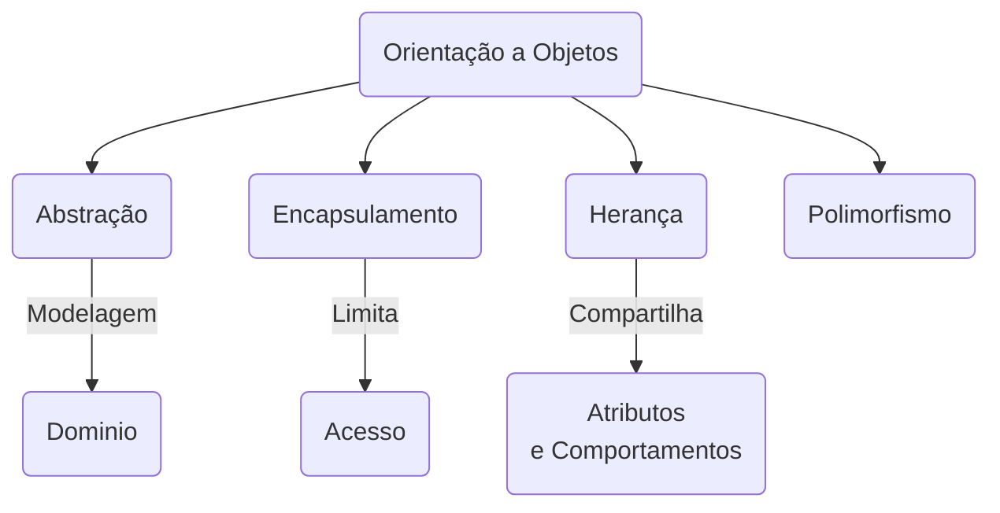
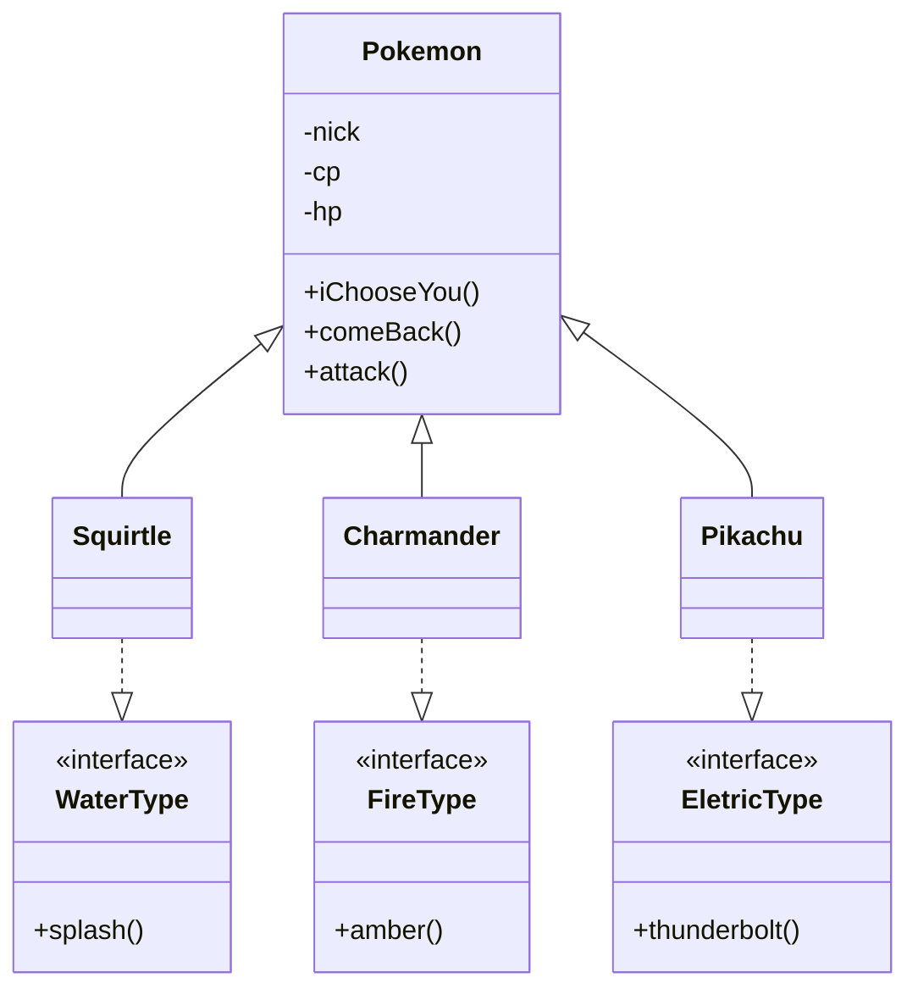

# POO Overview

```mermaid
flowchart TD
abs(Abstração)
enc(Encapsulamento)
her(Herança)
pol(Polimorfismo)
poo(Orientação a Objetos)

poo --> abs
poo --> enc
poo --> her
poo --> pol

abs --Modelagem -->dom(Dominio)
enc --Limita--> e1("Acesso")
her --Compartilha--> h1("Atributos\ne Comportamentos")
```

## Herança

```mermaid
classDiagram
class Pokemon {
    -nick
    -cp
    -hp
    +iChooseYou()
    +comeBack()
    +attack()
 }
class Squirtle { }
class Charmander { }
class Pikachu { }

class FireType { 
    <<interface>>
    +amber()
}

class EletricType { 
    <<interface>>
    +thunderbolt()
}

class WaterType { 
    <<interface>>
    +splash()
}

Pokemon <|-- Squirtle 
Pokemon <|-- Charmander
Pokemon <|-- Pikachu

Squirtle ..|> WaterType
Charmander ..|> FireType
Pikachu ..|> EletricType

```