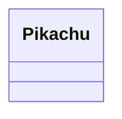
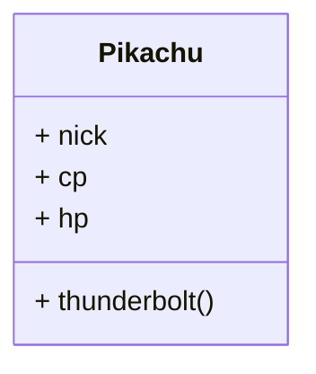
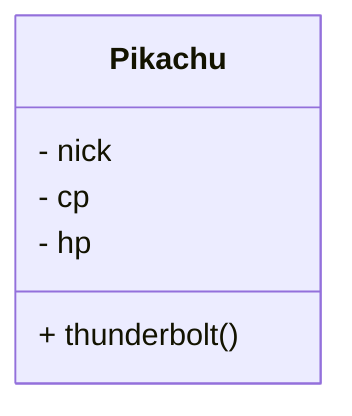
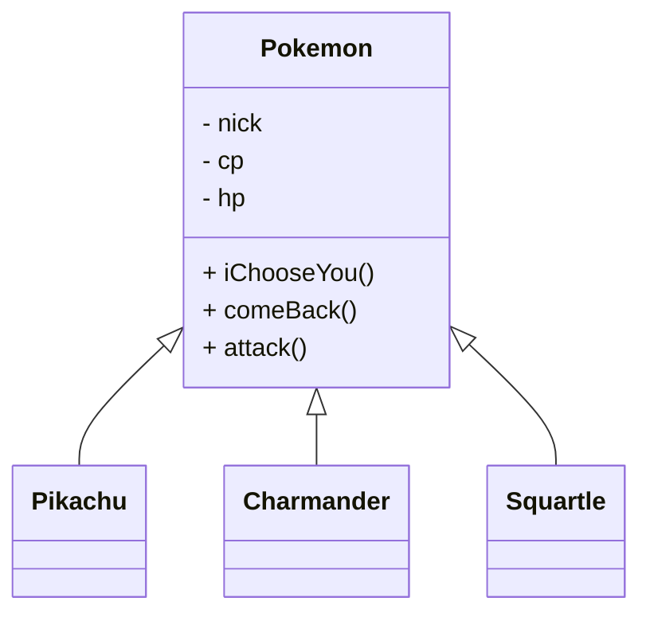
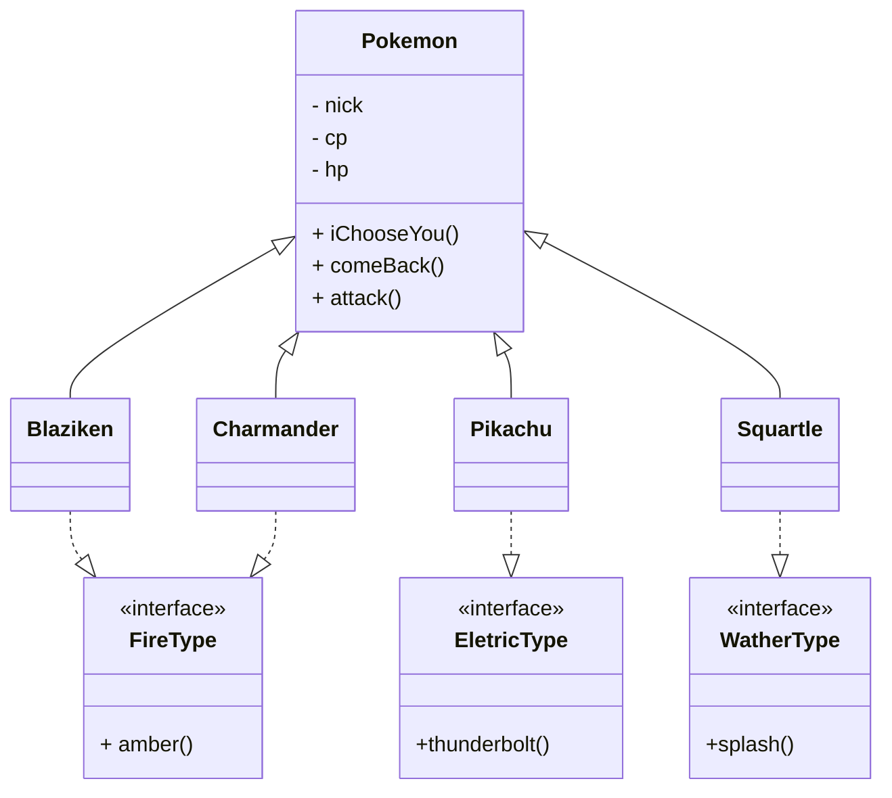
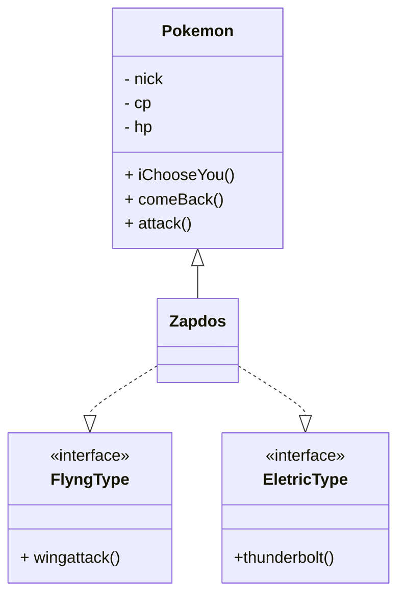
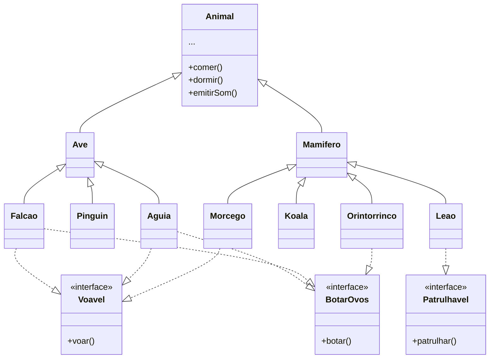

# Orientação à Objetos em Java

O paradigma de programação orientada a objetos tem por principal objetivo aproximar a programação como um todo, mais próxiima da realizadade do nosso cotidiano.

As relações entre os objetos do mundo real são adaptadas para um `mini-mundo` a ser construído em um programa de computador.

Esta concepção faz com que a modelagem de domínio se torne mais intuitiva além de possibilitar a criação de software mais fácil de manter e evoluir.

## Conceitos Básicos

Abaixo iremos demonstrar os principais conceitos da P.O.O (Programação Orientada a Objetos).

### Classe e Objeto

Em Java, tudo é encapsulado em classes e objetos. Uma classe é um modelo para objetos, e um objeto é uma instância de uma classe.



### Abstração

**Modelagem Conceitual**: Abstração é a capacidade de modelar objetos do mundo real no código, focando apenas nos detalhes essenciais e ignorando o não essencial.



### Encapsulamento:

**Atributos e Métodos**: As classes em Java possuem atributos (variáveis) e métodos (funções). O encapsulamento permite esconder a implementação interna e expor apenas a interface necessária.



### Herança

**Extensão de Classes**: Java suporta herança, permitindo que uma classe herde atributos e métodos de outra. A classe pai é chamada de superclasse, e a classe filha é chamada de subclasse.



### Polimorfismo

**Múltiplas Formas**: Polimorfismo permite que objetos de diferentes classes sejam tratados como objetos da mesma classe por meio de herança e interfaces. Existem dois tipos: estático (sobrecarga de método) e dinâmico (sobrescrita de método).


> Os Pokemons Blaziken e Charmander possuem múltiplas formas compartilhando o comportamento dos Pokemons do tipo fogo, além dos atributos e comportamentos comuns à todos os Pokemons


### Interfaces:

**Contratos de Implementação**: Interfaces em Java definem contratos que as classes devem seguir. Uma classe pode implementar várias interfaces, proporcionando flexibilidade no design.



> O Pokemon Zapdos assinou 2 contratos, dos Pokemons voadores e dos Pokemons elétricos, estes contratos possibilitam flexibilidade na modelagem de dominio e também contornam o impossibilidade de herança multipla em Java.  
    

## Demonstração.

O projeto contém a implementação da modelagem de dominio discutida acima; então vamos finalizar comentando o trecho de implementação.

```java
public class App {
    public static void main(String[] args) throws Exception {
        var pikachu = new Pikachu("Pikachu", 1500, 120);
        System.out.println(pikachu);
        pikachu.attack();

        var charmander = new Charmander("Charmander", 500, 90);
        System.out.println(charmander);
        charmander.attack();

        var zapdos = new Zapdos("zapdos", 800, 80);
        System.out.println(zapdos);
        zapdos.attack();

        // Demonstração do Polimorfismo
        List<Pokemon> pokemons = List.of(pikachu, charmander, zapdos);
        String template = "\n%s. Detalhes de heraça e polimorfismo. \n"+ 
        "\tInstancia de Pokemon: %s.\n"+
        "\tInstancia de FireType: %s.\n"+
        "\tInstancia de EletricType: %s.\n"+ 
        "\tInstancia de PoisonType: %s.\n"+
        "\tInstancia de FlyingType: %s. \n\n";
        
        pokemons.forEach(p -> {
            System.out.printf(template, p.getNick(), 
            (p instanceof Pokemon),
            (p instanceof FireType),
            (p instanceof ElectricType),
            (p instanceof PoisonType),
            (p instanceof FlyingType));
            p.attack();
        });

        /*
         * Para o código de demosntração acima, estamos extraindo um novo objeto.
         * Cada objeto mediante o uso dos artificios da herança e polimorfismo,
         * podemos perceber que o Pokemon Zabat por exemplo, é descendente dos 
         * Pokemons e também possui os tipos polimórficos Poison e Flying.
         * Ao executar os ataques, o polimorfismo possibilita que o tipo correto
         * seja inferido em tempo de execução, mesmo desconhecendo o tipo devido
         * à complexidade da herança utilizada na família de de classes.
         */
    }
}
```

## Zoo

Como detalhe extra da revisão considere a hierarquia de classes abaixo.

Podemos verificar o uso da herança e polimorfismo no Ornitorrinco e no Morcego.

> Me conte seu entendimento sobre esta hierarquia de classes e sobr eo polimorfismo na próxima aula.


